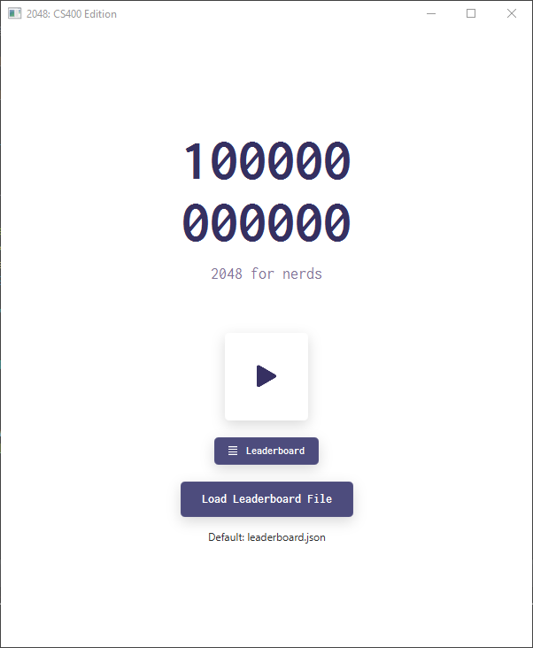
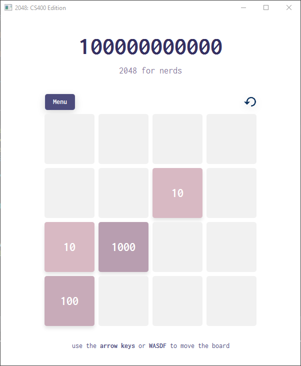

# 2048: CS400 Edition

> Recreating the game 2048 in JavaFX with a twist—Everything is in binary!

## Motivation

The problem is that there is not a fun enough, yet intellectually stimulating, game made with JavaFX.

## Concept

On a 4x4 playing board, the player can slide all the squares up, down, right, and left. If two squares with the same number slide into each other, they will combine into a single square with an incremented number. The player's goal is to combine the numbered squares until they reach 2048. They lose once the playing board is filled up and they can no longer combine any more squares.

## Screenshots

## The Team

- **William Cong,** X-Team 152, Lecture 001
- **Michael Gira,** X-Team 251, Lecture 002
- **Faith Isaac,** X-Team 213, Lecture 002
- **Quan Nguyen,** X-Team 251, Lecture 002
- **Hanyuan Wu,** X-Team 213, Lecture 002

This project was created by **A-Team 68** for CS400, Spring 2020 at the University of Wisconsin-Madison.
